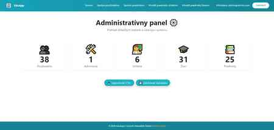
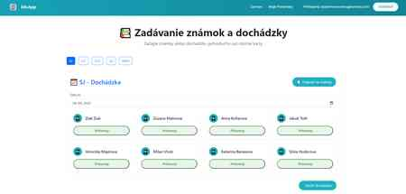

# EduApp – evidencia dochádzky a hodnotenia študentov

Webová aplikácia vytvorená v **ASP.NET Core MVC** na správu študentov, predmetov, známok a dochádzky. Projekt vznikol ako praktická časť bakalárskej práce **„ASP.NET Core aplikácia na evidenciu prítomnosti a hodnotenia študentov“**.


## O projekte

EduApp je školský informačný systém s rozhraním prispôsobeným podľa používateľskej roly. Aplikácia rozdeľuje funkcionalitu medzi **administrátora**, **učiteľa** a **žiaka**, takže každý používateľ pracuje iba s údajmi a funkciami, ktoré potrebuje.

### Administrátor

- prehľad základných štatistík systému,
- správa používateľských účtov,
- správa predmetov,
- priraďovanie predmetov učiteľom,
- priraďovanie predmetov žiakom,
- export používateľov do CSV,
- vytvorenie databázovej zálohy.

### Učiteľ

- osobný profil a štatistiky,
- prehľad vyučovaných predmetov,
- zadávanie a úprava známok,
- evidencia prítomnosti a neprítomnosti žiakov.

### Žiak

- osobný profil so základnými štatistikami,
- prehľad predmetov a priemerov,
- zobrazenie všetkých známok podľa predmetov,
- prehľad dochádzky.

## Použité technológie

| Oblasť | Technológie |
| --- | --- |
| Backend | C#, .NET 8, ASP.NET Core MVC |
| Dáta | Entity Framework Core, MySQL 8 |
| Frontend | Razor Views, Bootstrap 5, Bootstrap Icons, vlastné CSS |
| Autentifikácia | Cookie Authentication, role-based authorization |
| Architektúra | MVC + oddelené vrstvy Application, Domain a Infrastructure |
| Vývoj | Visual Studio / .NET CLI, EF Core migrations |

## Ukážky aplikácie

Nasledujúce snímky pochádzajú z obrazovej prílohy bakalárskej práce a zachytávajú reálne rozhranie systému.

### Administrátorské rozhranie

Administrátor má centrálny prehľad o používateľoch, učiteľoch, žiakoch a predmetoch a môže spravovať jednotlivé časti systému.



### Učiteľské rozhranie

Učiteľ pracuje s predmetmi, ktoré vyučuje, a môže evidovať známky aj prítomnosť alebo neprítomnosť žiakov.



### Žiacke rozhranie

Žiak má prístup k vlastným výsledkom. Známky sú rozdelené podľa predmetov a systém zobrazuje aj vypočítané priemery.


## Štruktúra projektu

```text
ASP.NET-Core-Dochadzka/
├── Application/       # aplikačná logika, commands a queries
├── Controllers/       # MVC controllery
├── Domain/            # doménové konštanty a pravidlá
├── Infrastructure/    # databáza, autorizácia, migrácie a seed
├── Models/            # dátové modely
├── Shared/            # spoločné filtre a pomocné komponenty
├── ViewModels/        # modely pre používateľské rozhranie
├── Views/             # Razor Views
└── Program.cs         # konfigurácia aplikácie a DI
```

## Lokálne spustenie

### Požiadavky

- **.NET 8 SDK**
- **MySQL 8.x**

### 1. Naklonovanie repozitára

```bash
git clone https://github.com/jelgorn/ASP.NET-Core-Dochadzka.git
cd ASP.NET-Core-Dochadzka
```

### 2. Nastavenie databázy

Vytvor MySQL databázu a nastav vlastný connection string `DefaultConnection`. Pre lokálny vývoj je vhodné nepoužívať produkčné prihlasovacie údaje priamo v repozitári.

Príklad:

```json
{
  "ConnectionStrings": {
    "DefaultConnection": "Server=localhost;Database=bakalarka;User=YOUR_USER;Password=YOUR_PASSWORD;"
  }
}
```

### 3. Spustenie aplikácie

```bash
dotnet restore
dotnet run
```

Pri štarte aplikácia aplikuje dostupné **EF Core migrations** a vytvorí demo používateľov, ak ešte v databáze neexistujú.

## Demo účty

| Rola | Email | Heslo |
| --- | --- | --- |
| Admin | `admin@demo.sk` | `Admin123!` |
| Žiak | `user@demo.sk` | `User123!` |

> Demo účty sú určené iba na lokálne/testovacie použitie.

## Kontext projektu

Projekt bol vytvorený v roku **2025** ako praktická časť bakalárskej práce na Pedagogickej fakulte Katolíckej univerzity v Ružomberku. Cieľom bolo navrhnúť a implementovať prehľadnú webovú aplikáciu pre evidenciu prítomnosti a hodnotenia študentov s viacúrovňovým používateľským rozhraním.

---

**Autor:** Sebastián Šatan  
**Technológie:** ASP.NET Core MVC · C# · Entity Framework Core · MySQL · Bootstrap
